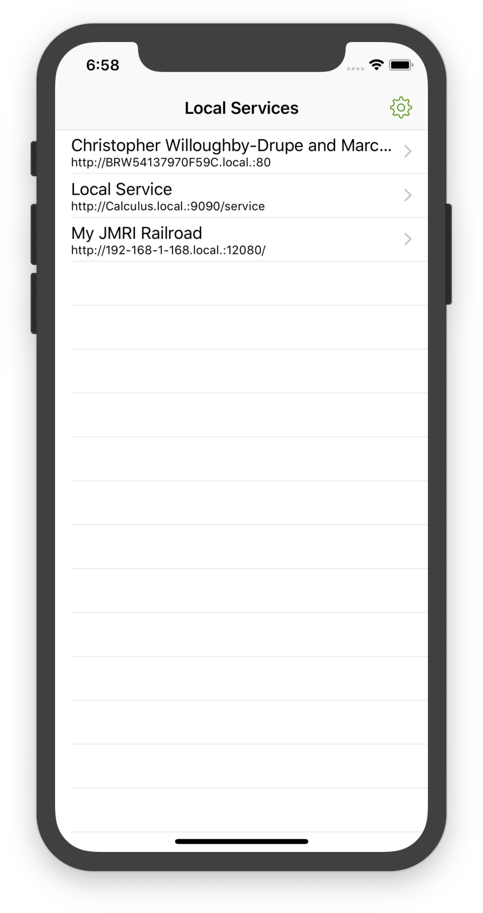

  

    

      <strong>Hola Browser searches for, and displays, web sites on your Wi-Fi network.</strong>
    

  

  

    
  

  

    <h2>Find and display <a href="">Bonjour</a> sites on your local Wi-Fi network.</h2>

    
Many devices, such as printers, in a Wi-Fi network publish sites to allow anyone on that network to control them. Hola Browser can find and display these devices, providing visability of your network and usability of your devices in a single app.

    
  

  

    <ul>
      <li><a href="/hola/privacy">Privacy Policy</a></li>
    </ul>
  

